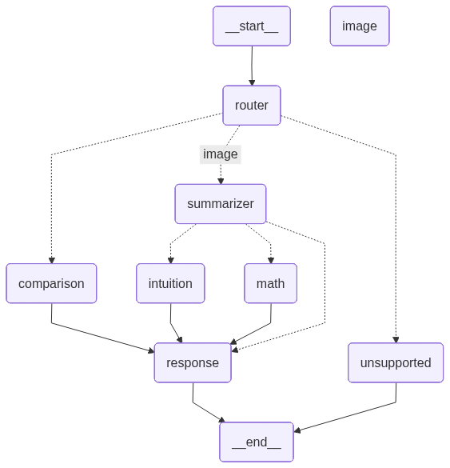
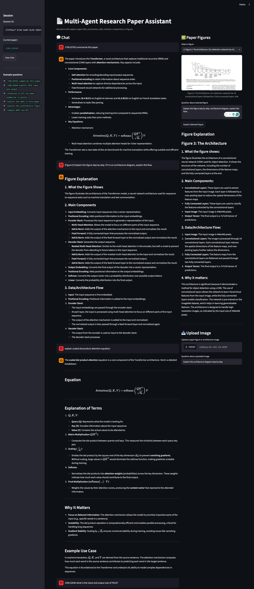
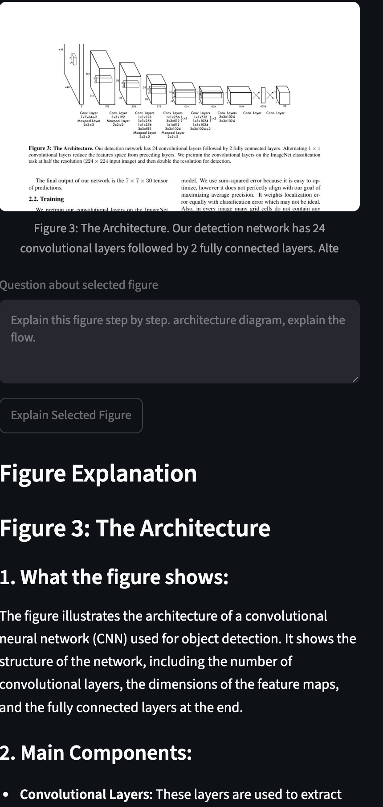
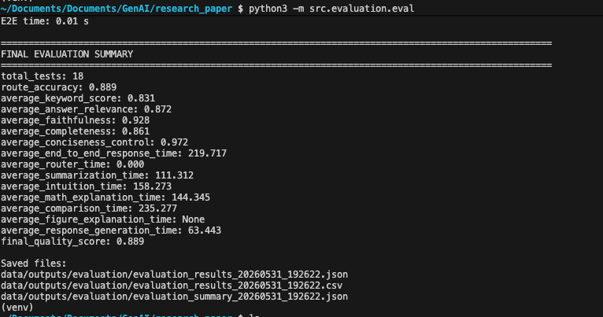

# Multi-Agent-Research-Paper-Assistant-using-LangGraph

A multi-agent AI system that helps users understand research papers from arXiv, paper URLs, or paper titles. The system can summarize papers, explain math equations, provide intuitive explanations, compare multiple papers, and explain figures/architecture diagrams using local LLMs.

The project supports:

- paper summarization
- math explanation
- intuition-based explanations
- figure understanding
- multi-paper comparison
- conversational follow-up Q&A

The system works with:

- arXiv IDs
- paper titles
- paper URLs

and runs fully on local LLMs using Ollama.

## Features

- Multi-agent workflow using LangGraph
- Research paper parsing using PyMuPDF
- Equation extraction and math reasoning
- Table and figure extraction from PDFs
- Figure explanation using vision-language models
- Stateful conversational memory
- Support for follow-up questions
- Paper comparison across multiple papers
- Streamlit chat interface
- Local inference using Ollama models

## Architecture




The workflow is orchestrated using LangGraph
Agents used in the system:

- Router Agent
- Summarizer Agent
- Math Agent
- Intuition Agent
- Comparison Agent
- Image Agent
- Response Agent

## Screenshots

### Streamlit Chat Interface




### Figure Explanation




### Evaluation Results




## Evaluation

The system was evaluated on:

- summarization
- equation explanation
- comparison tasks
- routing accuracy
- unsupported-query handling

| Metric | Score |
|---|---:|
| Route Accuracy | 88.9% |
| Answer Relevance | 87.2% |
| Faithfulness | 92.8% |
| Completeness | 86.1% |
| Conciseness Control | 97.2% |
| Final Quality Score | 88.9% |

## Tech Stack

- Python
- LangGraph
- LangChain
- FastAPI
- Streamlit
- Pydantic
- PyMuPDF
- Ollama
- Qwen / Qwen2.5-VL
- Local LLMs
- Multimodal AI

## Project Structure

```text
research-paper-agent/
├── src/
│   ├── agents/
│   ├── workflows/
│   ├── tools/
│   ├── schemas/
│   ├── llm/
│   └── evaluation/
├── streamlit_app.py
├── requirements.txt
├── README.md
└── app.py

## Setup

1. Clone Repository
git clone https://github.com/YOUR_USERNAME/Multi-Agent-Research-Paper-Assistant-using-LangGraph.git
cd Multi-Agent-Research-Paper-Assistant-using-LangGraph

2. Create Virtual Environment
python3 -m venv venv
source venv/bin/activate

3. Install Requirements
pip install -r requirements.txt

4. Install Ollama Models

Install Ollama first:

https://ollama.com/download

Pull required models:

ollama pull qwen2.5:7b
ollama pull qwen2.5vl:7b

Start Ollama:

ollama serve

5. Run Streamlit App
streamlit run streamlit_app.py

6. Example Queries
1706.03762 summarize this paper

1506.02640 Explain YOLO loss equation

1810.04805 Explain why BERT is bidirectional
